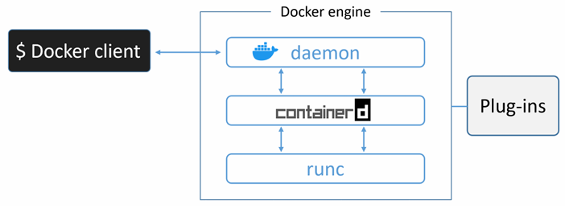

<!-- TOC start (generated with https://github.com/derlin/bitdowntoc) -->

- [Docker](#docker)
- [Introduction](#introduction)
   * [Containers](#containers)
      + [Linux Containers](#linux-containers)
      + [Microsoft Containers](#microsoft-containers)
      + [Microsoft vs Linux](#microsoft-vs-linux)
      + [Mac Containers](#mac-containers)
   * [Kubernetes](#kubernetes)
   * [Docker](#docker-1)
      + [Docker, Inc.](#docker-inc)
      + [Technology](#technology)
   * [The Open Container Initiative (OCI)](#the-open-container-initiative-oci)
- [The Docker Engine](#the-docker-engine)
   * [Docker Engine - The TLDR](#docker-engine-the-tldr)
   * [Docker Engine - The Deep Dive](#docker-engine-the-deep-dive)
      + [Get rid of LXC](#get-rid-of-lxc)
      + [Get rid of the monolithic daemon](#get-rid-of-the-monolithic-daemon)
      + [runc](#runc)
      + [containerd](#containerd)
      + [Starting a new container](#starting-a-new-container)
      + [Shim](#shim)
      + [Securing client and daemon communication](#securing-client-and-daemon-communication)
- [Images](#images)
   * [Images and Containers](#images-and-containers)

<!-- TOC end -->

<!-- TOC -->
# Docker

<!-- TOC -->
# Introduction

Applications are the heart of the businesses. If applications break, bussinesses break. 

In the past we could only run one application per server. With so, every time the business needed a new application, the IT department needed to buy a new sever. As nobody nows what was the performance requirements of that new application the IT department bough big fast servers that cost a lot of money. After all no one wanted under-powed servers unable to run some functionalities of the server application. As a result we had over-powered servers wasting company resources.

Eventually virtual machines (VM) appears. The technollogy allowed us to safely and securely run multiple business applications on a single server. 

The problem is that each VM requires its own operating system (OS). Every OS consumes CPU, RAM and other resources that could otherwise be used to power more applications. Every OS needs patching and monitoring. Almost every OS requires a licese. All of this results in waste time and resources. VMs are, also, slow to boot, and portability isn’t great

<!-- TOC -->
## Containers

In the container model, the container is roughly analogous to the VM. A major difference is that containers do not require their own OS. In fact, all containers on a single host share the host’s OS. This solves all the problems VMs have. Containers are fast to start and ultra-portable.

> Containers are lightweight, standalone, and executable package that contains everything needed to run a piece of software. It encapsulate an application and its dependencies, allowing it to run reliably and consistently accross different computing enviroments.
> 

<!-- TOC -->
### Linux Containers

Linux containers are a crucial component of modern computing, originating from extensive contributions within the Linux community, notably from Google. Docker which democratized their usage. While similar concepts existed before Docker, its simplicity made containers accessible to a wider audience.

<!-- TOC -->
### Microsoft Containers

Microsoft has also made significant strides, bringing Docker and container technologies to the Windows platform, enabling compatibility with Linux containers through tools like Docker Desktop. 

<!-- TOC -->
### Microsoft vs Linux

It is vital to understand that a running container sares the kernel of the host machine it is running on. This means that a containerized Windows app will not run on a Linux-based Docker host. 

It is possible to run Linux containers on Windows machines. For example, Docker Desktop running on Windows has two modes: windows and linux containers.  Linux container run either inside a lightweight Hyper-V VM or using the Windows Subsystem for Linux (WSL).

<!-- TOC -->
### Mac Containers

Mac containers don't exist; developers typically run Linux containers on their Mac using Docker Desktop, which operates them within a lightweight Linux VM.

<!-- TOC -->
## Kubernetes

Kubernetes is an open-source project out of Google that has quickly emerged as the most popular tool for deploying and managing containerized apps.

<aside>
 A conteinerized app is an application running as a container.

</aside>

Kubernetes uses Docker as its default container runtime (will be explained later what this means).  However, Kubernetes has a pluggable container runtime interface (CRI) that makes it easy to swap-out Docker for a different container runtime. In the future, Docker might be replaced by `containerd` as the default container runtime in Kubernetes. Summarizing, `containerd` is the small specialized part of Docker that does the low-level tasks of starting and stopping containers.

<!-- TOC -->
## Docker

When we refer Docker we can refer both, Docker Inc. and the technology.

<!-- TOC -->
### Docker, Inc.

Company founded in San Francisco by Solomon Hykes (not anymore in the company). Started as a platform as a service (PaaS provider called dotCloud. Behind the scenes, the dotClodu platform was build on Linux containers. 

To help create and manage these containers, they built an in-house tool with the name Docker. This name comes from a British expresion menaning *dock* work*er* (somebody who loads and uploads cargo from ships).

In 2013 they god rid of the PaaS sidde of the business, rebranded the company and focussed on bringing Docker and containers to the world. They have success in this task but are far to make a profitable business.

<!-- TOC -->
### Technology

Docker is a softare that runs in Linux and Windows. It creates, manages, and can even orchestrate containers.
The software is currently built from various tools from the *Moby* open-source project. Later will be explain how it works.

<!-- TOC -->
## The Open Container Initiative (OCI)

The OCI is a governance council, organized under the auspices of the Linux Foundations, responsible for standarizing the low-level fundamental components of container infrastructure. In particular it focusses on image format and container runtime.

<!-- TOC -->
# The Docker Engine

To master a technology, it is neccessary to understand what is going on under the hood.

<!-- TOC -->
## Docker Engine - The TLDR

The Docker engine is the core software that runs and manages containers. We often refer to it simply as Docker.

Docker is a modular in design and built from small specialised tools. Where possible, these are based on open standards such as those maintained by the Open Container Initiative (OCI). This tools work together to create and run containers (APIs, execution driver, runtimes, shims etc.)

The major components that make up the Docker engine are

- Docker daemon
- containerd (c)
- runc (r)

and various plugins such as networking and storage. Together, these create and run containers.

<!-- TOC -->
## Docker Engine - The Deep Dive

When Docker was released, had two major components

- The Docker daemon → monolithic binary that contained all of the code for the Docker client, the Docker API, the container runtime, the image builds and **much** more.
- LXC → provided the daemon with access to the fundamental building-blocks of containers that existed in the Linux kernel such as *namespaces* and *control groups* (*cgroups*).

<aside>
 cgroups (Linux kernel feature) enables the management and limitation of system resources like CPU, memory and network badwidth, among others. We can use them for setting limits on these resources and distribute them among different groups of processes.
Namespaces (Linux kernel feature) provide a process with its own isolated view of the sustems such as its own file sistem, network, hostname and more. They allow as to create isolated enviroments for processes so thet they can’t access or affect other process or the host system.

Summary: cgroups provide resource management and namespace provide isolation and security.

</aside>

<!-- TOC -->
### Get rid of LXC

LXC was an issue from start. First becouse is Linux-specific and the aspirations were of being multi-platform. Second becouse is risk to rely on an external tool for something so core.

As a result, they develop a tool called libcontainer as a replacement for LXC. The goal was to access to the fundamental container building-blocks that exist in the host kernel.

<!-- TOC -->
### Get rid of the monolithic daemon

The plan was refactoring the daemon into small specialized tools that can be pieced together into larger tools. After all, all of the ***container execution*** and ***container runtime*** code entirely removed from the daemon and refactored into small, specialized tools.

In the old model, where all of container runtime logic was implemented in the daemon, starting and stopping the daemon would kill all running containers on the host. This was a huge problem in production environments. Every daemon upgrade would kill all containers on that host.

<!-- TOC -->
### runc

runc is the reference implementation of the OCI container-runtime-spec. runc is a small lightweight CLI wrapper for libcontainer. 

Its  purpose is to create containers. It is good and fast but as it’s a CLI wrapper, it’s effectively a standalone container runtime tool. This means you can download and build the binary, and you’ll have everithing you need to build and play with runc (OCI) containers. But you will have none of the richness that you get with the full-blown Docker engine.

<!-- TOC -->
### containerd

All of the container execution logic is ripped out and refactored into an new tool called containerd. Its sole purpose (at the beginning) was to manage the containers lifecycle.

Eventually was branched out and taken on more functionalities such as *image pull*, *volumes* and *networks*. One of the reasons for these change of mind is to make it easier to use in other projects. However, all the extra functionality is modular and optional.

<!-- TOC -->
### Starting a new container

<!-- TOC -->
### Shim

The shim is integral to the implementation of daemonless containers.

containerd uses runc to create new containers. In fact, it forks a new instance of runc for every container it creates. However, once each container is created, the parent runc process exits. This means we can run hundreds of containers without having to run hundreds of runc instances.

Once a container’s parent runc process exits, the associated containerd-shim process becomes the container’s parent. Some of the responsibilities the shim performs as a container’s parent include:

- Reports the container’s exit status bar to the daemon.
- Keeping any STDIN and STDOUT streams open so that when the daemon is restarted, the container
doesn’t terminate due to pipes being closed etc.

<!-- TOC -->
### Securing client and daemon communication

Docker implements a client-server model

- The client component implements the CLI
- The server (daemon) component implements the functionality, including the public-facing REST API

The client is called *docker* and the daemon is called *dockerd*. A default installation puts them on the same host and configures them to communicate over a local IPC socket.

It is also possible to configure them to communicate over the network. By default, network communication occur over an unsecured HTTP socket on port `2375/tcp`.

An insecure configuration might be suitable for labs, but it is unacceptable for anything else.

Docker lets you force the client and daemon to only accept network connections that are secured with TLS. This is recommended for production environments, even if all traffic is traversing trusted internal networks.

You can secure both the client and the daemon. Securing the client forces the client to only connect to Docker daemons with certificates signed by a trusted Certificate Authority (CA). Securing the daemon forces the daemon to only accept connections from clients presenting certificates from a trusted CA. A combination of both modes offers the most security.

<!-- TOC -->
# Images

A docker image is a read-only template containing instructions for creating a Docker container. It includes everything needed to run an application, such as the code, runtime, libraries, and dependencies.

<aside>
 A container is a runnabel instance of an image

</aside>

You get docker images by pulling them from an image registry. The most common registry is Docker Hub. The *pull* operation downloads the image to your local Docker host where Docker can use it to start one or more containers.

Images are made up of multiple layers that are stacked on top of each other and represented as a single object. Inside of the image is a cut-down operating system (OS) and all of the files and dependencies required to run an application. Because containers are intended to be fast and lightweight, images tend to be small (Microsoft images tend to be huge).

Images are like classes. In fact, you can stop a container and create a new image from it. With so, images are considered *buidl-time* construct, whereas containers are *run-time* contructs

<!-- TOC -->
## Images and Containers

We use `docker container run` and `docker service create` commands to start one or more containers from a single image. Once you’ve started a container from an image, the two constructs become dependent on each other and yoy cannot delete the image until the last container using it has been stopped and destroyed.
