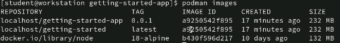

<!-- TOC start (generated with https://github.com/derlin/bitdowntoc) -->

- [M1](#m1)
- [Lab 2](#lab-2)
   * [1. Basic Command](#1-basic-command)
   * [2. Export](#2-export)
      + [**Differences:**](#differences)
      + [**Use Cases:**](#use-cases)
   * [3. Import](#3-import)
   * [4. While creating, manually modify](#4-while-creating-manually-modify)
   * [5. Change content of container without terminate it](#5-change-content-of-container-without-terminate-it)
   * [6. Questions](#6-questions)
      + [a. **Do containers lose their state when they are terminated, and are container tools changing that behavior?**](#a-do-containers-lose-their-state-when-they-are-terminated-and-are-container-tools-changing-that-behavior)
      + [b. **Do you need to pull the container image before creating a container?**](#b-do-you-need-to-pull-the-container-image-before-creating-a-container)
      + [**c. Does Podman support restart of container images?**](#c-does-podman-support-restart-of-container-images)
      + [Others](#others)
- [Lab 3](#lab-3)
   * [1. Containerize an Application](#1-containerize-an-application)
      + [Get the App](#get-the-app)
      + [Build the app’s image](#build-the-apps-image)
      + [Start an app container](#start-an-app-container)
   * [2. Instruction for Dockerfile](#2-instruction-for-dockerfile)
   * [3. Modify App](#3-modify-app)
      + [Update the source code](#update-the-source-code)
   * [4. Difference between images](#4-difference-between-images)
   * [5. Share the application](#5-share-the-application)
      + [Create a repository](#create-a-repository)
      + [Push the image](#push-the-image)
   * [6. Containerfile that uses `ubi8` as the base image](#6-containerfile-that-uses-ubi8-as-the-base-image)
   * [7. Quadlet file](#7-quadlet-file)
   * [8. Multi-Stage Builds](#8-multi-stage-builds)
      + [**Dockerfile1:**](#dockerfile1)
      + [**Dockerfile2:**](#dockerfile2)
      + [**Comparison:**](#comparison)
- [Lab 4](#lab-4)
   * [1. Network](#1-network)
   * [MySQL and Wordpress](#mysql-and-wordpress)
   * [Replace MySql container with Data Persistance](#replace-mysql-container-with-data-persistance)
      + [Bind Mount](#bind-mount)
      + [Volume](#volume)
      + [Differences](#differences-1)
   * [Podman-Compose](#podman-compose)

<!-- TOC end -->

<!-- TOC --><a name="m1"></a>
# M1

<!-- TOC --><a name="lab-2"></a>
# Lab 2

<!-- TOC --><a name="1-basic-command"></a>
## 1. Basic Command

1. Find Image
    
    ```bash
    podman search nginx
    ```
    
2. List running containers
    
    ```bash
    podman ps
    ```
    
3. Pull image
    
    ```bash
    podman image inspect nginx
    ```
    
4. Find more information about image
    
    ```bash
    podman images
    podman image inspect nginx
    ```
    
5. Create container on 8080 port
    
    ```bash
    podman run -d --name web8080 -p 8080:80 nginx
    ```
    
6. Inspect container details
    
    ```bash
    podman inspect web8080
    ```
    
7. Stop and delete a container
    
    ```bash
    podman stop <container_id_or_name>
    podman rm <container_id_or_name>
    ```
    
8. Remove an image
    
    ```bash
    podman rmi image_name_or_id
    ```
    
9. Change tag and name of an image
    
    ```bash
    podman tag IMAGE_ID new_repository_name/new_image_name:new_tag
    ```
    

<!-- TOC --><a name="2-export"></a>
## 2. Export

1. Using `save`
    
    **`podman save`** saves one or more images to a tar archive. It saves the container images along with their metadata and history. This means that it preserves information about the container image layers, tags, and how the image was built.
    
    ```bash
    # podman save [options] IMAGE_NAME > image.tar
    podman save nginx > image-nginx.tar
    ```
    
2. Using `export`
    
    **`podman export`** creates a tarball of the container's filesystem. It exports the filesystem content of a container into a tarball without saving the image's metadata or history. This means that it only saves the container's filesystem and doesn't include information about the container image layers or how the container was built.
    
    ```bash
    # podman export [options] CONTAINER_NAME > container.tar
    podman export web8080 > web8080.tar
    ```
    

<!-- TOC --><a name="differences"></a>
### **Differences:**

- **Export**: It exports the container's filesystem into a tarball without saving any image metadata or history. The resulting tarball is usually smaller because it only contains the container's filesystem.
- **Save**: It saves the container image along with its metadata and history into a tar archive. The resulting tar archive can be loaded back into Podman or Docker, and it will retain all the information about the image, including its layers, tags, and history.

<!-- TOC --><a name="use-cases"></a>
### **Use Cases:**

- **Export**: Useful if you only need the container's filesystem and don't care about the image metadata. For example, if you want to share files between containers or with systems that don't have Podman installed.
- **Save**: Useful for backup, sharing images between different environments, or distributing images to other users or systems. It's the preferred method for saving images for reuse.

<!-- TOC --><a name="3-import"></a>
## 3. Import

1. From `save`
    
    ```bash
    podman load -i image.tar
    ```
    
2. From `export`
    
    ```bash
    podman import exported_container.tar
    ```
    

<!-- TOC --><a name="4-while-creating-manually-modify"></a>
## 4. While creating, manually modify

Command which you can use while creating a container image, manually modifying and then saving that as a new image.

```bash
# Start a container
podman run -it --name my_container my_image /bin/bash

# Inside the container, make changes
# For example, install new packages, modify files, etc.

# Commit changes to a new image
podman commit my_container my_new_image

# Inside the container, make changes
# For example, install new packages, modify files, etc.
# For instance, if you want to install vim and edit a file:
apt-get update
apt-get install -y vim
echo "Hello, World!" > /path/to/file.txt
vim /path/to/file.txt

# After making your changes, exit the container
exit

# Commit changes to a new image
podman commit my_container my_new_image
```

<!-- TOC --><a name="5-change-content-of-container-without-terminate-it"></a>
## 5. Change content of container without terminate it

Command you can use to change the contents of the default web page of web8080 container without terminating it.

```bash
podman exec -it web8080 sh -c "echo '<html><body><h1>Other Title</h1></body></html>' > index.html"

# to open bash
podman exec -it web8080 bash
# in bash are able to do
cat /usr/share/nginx/html/index.html
# for exit bash
exit
```

<!-- TOC --><a name="6-questions"></a>
## 6. Questions

<!-- TOC --><a name="a-do-containers-lose-their-state-when-they-are-terminated-and-are-container-tools-changing-that-behavior"></a>
### a. **Do containers lose their state when they are terminated, and are container tools changing that behavior?**

Yes, by default, containers lose their state when they are terminated. This means that any changes made inside the container during its runtime, such as file modifications or installed packages, are lost when the container is stopped. However, container tools are evolving to change this behavior by introducing features like persistent storage and container checkpoints, allowing containers to retain their state even after termination.

<!-- TOC --><a name="b-do-you-need-to-pull-the-container-image-before-creating-a-container"></a>
### b. **Do you need to pull the container image before creating a container?**

In most cases, yes, you need to pull the container image before creating a container if the image is not already available locally. When you create a container, Podman needs access to the container image to run the container. If the image is not available locally, Podman will try to pull it from the specified registry (e.g., Docker Hub) before creating the container.

<!-- TOC --><a name="c-does-podman-support-restart-of-container-images"></a>
### **c. Does Podman support restart of container images?**

Yes, Podman supports the restart of container instances. You can specify restart policies when starting a container using the **`--restart`** flag with options like **`always`**, **`on-failure`**, **`unless-stopped`**, etc. This ensures that the container automatically restarts if it exits unexpectedly or if the system reboots.

Example:

```scss
podman run --restart=always my_image
```

These features enhance the usability and reliability of containers, making them more suitable for various use cases, including production environments.

For restarting a container that is already running

```bash
podman restart CONTAINER_NAME_OR_ID
```

<!-- TOC --><a name="others"></a>
### Others

**1. What is the difference between an image and a container in Podman?**

**Answer:** An image is a static, read-only template that contains the operating system, libraries, and dependencies needed to run an application. A container is a running instance of an image.

**2. What is Podman and how does it differ from Docker?**

**Answer:** Podman is a container management tool similar to Docker. It differs from Docker in that it does not require a daemon to run containers, making it more lightweight and suitable for environments where a daemon may not be desired.

**3. How do you view the logs of a running container in Podman?**

**Answer:** You can view the logs of a running container in Podman using the command **`podman logs CONTAINER_NAME_OR_ID`**.

**4. What is the purpose of a Dockerfile in containerization?**

**Answer:** A Dockerfile is a text file that contains the instructions needed to build a Docker image. It defines the steps to set up the container environment, install dependencies, copy files, and configure the application.

**5. How do you stop all running containers in Podman?**

**Answer:** You can stop all running containers in Podman using the command **`podman stop --all`**.

**6. What is a volume in containerization and how is it used?**

**Answer:** A volume in containerization is a directory or file that is mapped into the container's filesystem, allowing data to persist even when the container is stopped or deleted. Volumes are used for sharing data between containers or persisting data that needs to survive the container's lifecycle.

**7. How do you access a running container to execute a command inside it with Podman?**

**Answer:** You can access a running container to execute a command inside it using the command **`podman exec -it CONTAINER_NAME_OR_ID command`**.

**8. Can you restart a running container in Podman?**

**Answer:** Yes, you can restart a running container in Podman using the command **`podman restart CONTAINER_NAME_OR_ID`**.

**9. What is the difference between a Podman image and a Podman container?**

**Answer:** A Podman image is a template used to create containers, while a Podman container is a running instance of an image.

**10. How do you remove a container in Podman?**

**Answer:** You can remove a container in Podman using the command **`podman rm CONTAINER_NAME_OR_ID`**.

<!-- TOC --><a name="lab-3"></a>
# Lab 3

<!-- TOC --><a name="1-containerize-an-application"></a>
## 1. Containerize an Application

Containerize an application by following the [Containerize an application | Docker Docs](https://docs.docker.com/get-started/02_our_app/) gide

<!-- TOC --><a name="get-the-app"></a>
### Get the App

1. Clone the [getting-started-app repository](https://github.com/docker/getting-started-app/tree/main) using the following command:
    
    ```bash
    $ git clone https://github.com/docker/getting-started-app.git
    ```
    
2. Create an empty file named `Dockerfile`
    
    ```bash
    cd /path/to/getting-started-app
    touch Dockerfile
    ```
    

<!-- TOC --><a name="build-the-apps-image"></a>
### Build the app’s image

1. Using a text editor or code editor, add the following contents to the Dockerfile:
    
    ```bash
    # syntax=docker/dockerfile:1
    
    FROM node:18-alpine
    WORKDIR /app
    COPY . .
    RUN yarn install --production
    CMD ["node", "src/index.js"]
    EXPOSE 3000
    ```
    
2. Build the image using the following commands:
    
    ```bash
    cd /path/to/getting-started-app
    podman build -t getting-started .
    
    # For tagging the image with 0.0.1
    podman build -t getting-started-app:0.0.1 .
    ```
    
    <aside>
     The `docker build` command uses the Dockerfile to build a new image. You might have noticed that Docker downloaded a lot of "layers". This is because you instructed the builder that you wanted to start from the `node:18-alpine` image. But, since you didn't have that on your machine, Docker needed to download the image.
    
    
    
    After Docker downloaded the image, the instructions from the Dockerfile copied in your application and used `yarn` to install your application's dependencies. The `CMD` directive specifies the default command to run when starting a container from this image.
    
    Finally, the `-t` flag tags your image. Think of this as a human-readable name for the final image. Since you named the image `getting-started`, you can refer to that image when you run a container.
    
    The `.` at the end of the `docker build` command tells Docker that it should look for the `Dockerfile` in the current directory.
    
    </aside>
    

<!-- TOC --><a name="start-an-app-container"></a>
### Start an app container

1. Run the container
    
    ```bash
    podman run -dp 127.0.0.1:3000:3000 getting-started
    ```
    
    <aside>
     The `-d` flag (short for `--detach`) runs the container in the background. This means that Docker starts your container and returns you to the terminal prompt. You can verify that a container is running by viewing it in Docker Dashboard under **Containers**, or by running `docker ps` in the terminal.
    
    The `-p` flag (short for `--publish`) creates a port mapping between the host and the container. The `-p` flag takes a string value in the format of `HOST:CONTAINER`, where `HOST` is the address on the host, and `CONTAINER` is the port on the container. The command publishes the container's port 3000 to `127.0.0.1:3000` (`localhost:3000`) on the host. Without the port mapping, you wouldn't be able to access the application from the host.
    
    </aside>
    
2. Web in the browser  [http://localhost:3000](http://localhost:3000/)
    
    
    
    
    

<!-- TOC --><a name="2-instruction-for-dockerfile"></a>
## 2. Instruction for Dockerfile

[Dockerfile reference | Docker Docs](https://docs.docker.com/reference/dockerfile/)

<!-- TOC --><a name="3-modify-app"></a>
## 3. Modify App

Modify the app by following the [Update the application | Docker Docs](https://docs.docker.com/get-started/03_updating_app/) gide.

<!-- TOC --><a name="update-the-source-code"></a>
### Update the source code

1. In the `src/static/js/app.js` file, update line 56 to use the new empty text.
    
    ```
    - <p className="text-center">No items yet! Add one above!</p>
    + <p className="text-center">You have no todo items yet! Add one above!</p>
    ```
    
2. Build the updated version of the image
    
    ```bash
    podman build -t getting-started .
    # For tagging the image with 0.0.2
    podman build -t getting-started-app:0.0.2 .
    ```
    
    
    
3. Start a new container using the updated code
    
    ```bash
    podman run -dp 127.0.0.1:3000:3000 getting-started
    ```
    
    <aside>
     You will probably saw an error like this
    
    ```bash
    docker: Error response from daemon: driver failed programming external connectivity on endpoint laughing_burnell 
    (bb242b2ca4d67eba76e79474fb36bb5125708ebdabd7f45c8eaf16caaabde9dd): Bind for 127.0.0.1:3000 failed: port is already allocated.
    ```
    
    This is becouse the other container is running. To fix this, you need to remove the old container.
    
    ```bash
    # if running
    podman stop <container_id or container_name>
    
    podman rm <container_id or container_name>
    ```
    
    </aside>
    


<!-- TOC --><a name="4-difference-between-images"></a>
## 4. Difference between images

```bash
podman diff [id Image|Container] [id Image|Container]
```

<!-- TOC --><a name="5-share-the-application"></a>
## 5. Share the application

<!-- TOC --><a name="create-a-repository"></a>
### Create a repository

1. [Sign up](https://www.docker.com/pricing?utm_source=docker&utm_medium=webreferral&utm_campaign=docs_driven_upgrade) or Sign in to [Docker Hub](https://hub.docker.com/).
2. Select the **Create Repository** button.
3. For the repository name, use `getting-started`. Make sure the **Visibility** is **Public**.
4. Select **Create**.

<!-- TOC --><a name="push-the-image"></a>
### Push the image

1. Sign in to Docker hub
    
    ```bash
    podman login docker.io
    user (mrcharleshr) and password (7S-Wvkud35BuK.Q)
    ```
    
2. Give the `getting-started` image a new name
    
    ```bash
    podman tag localhost/getting-started:tag mrcharleshr/getting-started:tag
    ```
    
3. Use the `podman push` command again. 
    
    ```bash
    podman push mrcharleshr/getting-started:tagname
    ```
    
    <aside>
     Docker by default uses a tag called `latest`.
    
    </aside>
    
4. To run the pushed app
    
    ```bash
    docker run -dp 0.0.0.0:3000:3000 mrcharleshr/getting-started
    ```
    

<!-- TOC --><a name="6-containerfile-that-uses-ubi8-as-the-base-image"></a>
## 6. Containerfile that uses `ubi8` as the base image

Create another Containerfile which will use ubi8 image as a base image. Update all installed packages and install httpd. Configure the image in a way that httpd is started as container is created. Name the image myweb and tag it 0.0.1. Note that the image is in a private repository to which you can login with podman login.

1. Create a new file named `Containerfile` in the `getting-starte-app` with the following content:
    
    ```bash
    FROM ubi8
    
    # Update all installed packages
    RUN yum -y update && \
        yum clean all
    
    # Install httpd
    RUN yum -y install httpd && \
        yum clean all
    
    # Start httpd when the container is created
    CMD ["httpd", "-D", "FOREGROUND"]
    ```
    
2. Build the image and tag it as **`myweb:0.0.1`**
    
    ```bash
    podman build -t myweb:0.0.1 -f Containerfile .
    ```
    
3. Log in to the private repository where you want to push it
    
    ```bash
    podman login docker.io
    user (mrcharleshr) and password (7S-Wvkud35BuK.Q)
    ```
    
4. Push the image to the repository
    
    ```bash
    podman push myweb:0.0.1 mrcharleshr/myweb:0.0.1
    ```
    

<!-- TOC --><a name="7-quadlet-file"></a>
## 7. Quadlet file

Create a quadlet file to configure the system so a container named web from image myweb:0.0.1 is with the system. There is a guide available at [https://www.redhat.com/sysadmin/quadlet-podman](https://www.redhat.com/sysadmin/quadlet-podman).

<aside>
 `systemd` is a system and service manager for Linux OS. It’s designed to manage the startup, shutdown, and general operation of the system, including managing system services and daemons.

In the context of container management with tools like Podman, `systemd` integration allows managing containers as systemd services. This means you can control containers using the same mechanisms used for other system services.

</aside>

<aside>
 `quadled` is a concept in Podman used to define the container’s resource constraints. It consists of four parameters:

- CPU shares
- CPU period
- CPU quota
- Memory limit

This parameters can be adjusted to control how much CPU and memory resources a container is allocated. They provide finer-grained control over resource allocation and utilization within Podman.

</aside>

1. **Create the Quadlet File**:
    
    Open a text editor and create a file named **`web-container.container`** in the appropriate directory according to your setup:
    
    ```bash
    mkdir -p .config/containers/systemd
    touch web-container.container
    cd .config/containers/systemd
    nano web-container.container
    ```
    
    Then, add the following content to the file:
    
    ```yaml
    [Unit]
    Description=Web container
    After=network.target
    
    [Container]
    Image=myweb:0.0.1
    Exec=/path/to/startup/script.sh
    
    [Install]
    WantedBy=multi-user.target default.target
    
    ```
    
    Replace **`/path/to/startup/script.sh`** with the path to the script you want to execute in the container.
    
    For the script you can do:
    
    1. Create the script
        
        ```bash
        nano startup_script.sh
        ```
        
    2. Add a command to be exec
        
        ```bash
        #!/bin/bash
        echo "Hello, world!"
        ```
        
    3. Make the script executable
        
        ```bash
        chmod +x startup_script.sh
        ```
        
2. **Inform systemd About the New Unit File**:
    
    Run the following command to inform systemd about the new unit file:
    
    ```bash
    systemctl --user daemon-reload
    ```
    
3. **Check the Status of the Service**:
    
    You can check the status of your container service with:
    
    ```bash
    systemctl --user status web-container.service
    ```
    
    This will show the status of the service, including whether it's active or inactive.
    
4. **Start the Service**:
    
    Start your container service with:
    
    ```bash
    systemctl --user start web-container.service
    ```
    
    This will start the container using the specified image and script.
    
5. **Verify**:
    
    You can verify that your container is running by checking its status again:
    
    ```bash
    systemctl --user status web-container.service
    ```
    

<!-- TOC --><a name="8-multi-stage-builds"></a>
## 8. Multi-Stage Builds

Clone git repository available at [https://github.com/jstanesic/example-go-app](https://github.com/jstanesic/example-go-app). Build a container image by using Dockerfile Dockerfile1 and tag it example:Dockerfile1. Build another image by using Dockerfile Dockerfile2 and tag it example:Dockerfile2. Check sizes of the images. Discover what benefits multi-stage builds has in use cases when application needs to be compiled.

1. Clone repo
    
    ```bash
    git clone https://github.com/jstanesic/example-go-app
    cd example-go-app
    ```
    
2. Build Docker images
    
    ```bash
    podman build -t example:Dockerfile1 -f Dockerfile1 .
    
    podman build -t example:Dockerfile2 -f Dockerfile2 .
    ```
    
3. Check sizes
    
    ```bash
    podman images example:Dockerfile1
    podman images example:Dockerfile2
    ```
    


The explanation is

<!-- TOC --><a name="dockerfile1"></a>
### **Dockerfile1:**

```bash
DockerfileCopy code
FROM bitnami/golang:1.13 as builder

# Install dependencies and build the application
RUN go get github.com/urfave/negroni
COPY server.go /
RUN go build /server.go

# Define the default command to run the compiled application
CMD /go/server

```

- **Benefits**:
    - The resulting container only contains the compiled application and its direct dependencies.
    - It's simpler and straightforward, as it only has a single build stage.

<!-- TOC --><a name="dockerfile2"></a>
### **Dockerfile2:**

```
DockerfileCopy code
FROM bitnami/golang:1.13 as builder

# Install dependencies and build the application
RUN go get github.com/urfave/negroni
COPY server.go /
RUN go build /server.go

# Second stage: create a smaller image for execution
FROM bitnami/minideb:stretch

# Set up the application environment and copy the compiled binary
RUN mkdir -p /app
WORKDIR /app
COPY --from=builder /go/server .
COPY page.html .
RUN useradd -r -u 1001 -g root nonroot
RUN chown -R nonroot /app
USER nonroot
ENV PORT=8080

# Define the default command to run the compiled application
CMD /app/server

```

- **Benefits**:
    - It uses a two-stage build: the first stage for compiling the application and the second stage for packaging it into a smaller final image.
    - The final image is smaller as it doesn't include the build environment, only what's necessary to run the application.
    - It improves security by minimizing the amount of unnecessary software in the final image.

<!-- TOC --><a name="comparison"></a>
### **Comparison:**

- Dockerfile1 is simpler and suitable for small applications or quick tests.
- Dockerfile2 is more robust and suitable for production applications, as it produces a smaller and more secure image by separating the build environment from the runtime environment.

<!-- TOC --><a name="lab-4"></a>
# Lab 4

<!-- TOC --><a name="1-network"></a>
## 1. Network

1. List all networks
    
    ```bash
    podman network ls --filter driver=bridge --filter name=podman
    
    # By using podman network command list all podman networks. 
    # It should only show default  network called podman with the bridge driver. 
    podman network ls
    ```
    
2. Inspect the network to find the value of the **`dns_enabled`** setting:
    
    ```bash
    podman network inspect podman
    ```
    
    
    
3. Create a custom network named labnet with DNS enabled
    
    ```bash
    podman network create labnet # is created by default with dn
    ```
    

<!-- TOC --><a name="mysql-and-wordpress"></a>
## MySQL and Wordpress

1. Create a MySql db container named `mysql` using the official MySQL image ([https://hub.docker.com/_/mysql](https://hub.docker.com/_/mysql))
    
    ```bash
    podman run -d --name mysql --network labnet \
        -e MYSQL_ROOT_PASSWORD=$(openssl rand -base64 12) \
        -e MYSQL_DATABASE=wordpress \
        -e MYSQL_USER=student \
        -e MYSQL_PASSWORD=DB15secure! \
        mysql:latest
    ```
    
    ```bash
    podman run -d --name mysql --network labnet -e MYSQL_ROOT_PASSWORD=$(openssl rand -base64 12) -e MYSQL_DATABASE=wordpress -e MYSQL_USER=student-e MYSQL_PASSWORD=DB15secure! mysql:latest
    ```
    
2. Create a WordPress container connected to the "labnet" network and publish port 80 to port 8080 on the host:
    
    ```bash
    podman run -d --name wordpress --network labnet \
        -p 8080:80 \
        -e WORDPRESS_DB_HOST=mysql \
        -e WORDPRESS_DB_NAME=wordpress \
        -e WORDPRESS_DB_USER=student \
        -e WORDPRESS_DB_PASSWORD=DB15secure! \
        wordpress:latest
    ```
    
    ```bash
    podman run -d --name wordpress --network labnet -p 8080:80 -e WORDPRESS_DB_HOST=mysql -e WORDPRESS_DB_NAME=wordpress -e WORDPRESS_DB_USER=student -e WORDPRESS_DB_PASSWORD=DB15secure! wordpress:latest
    ```
    
    Wordpress will be active in [http://localhost:8080](http://localhost:8080) where u re able to create a page.
    
    <aside>
     If you repeated the previous two steps using the default network, it wouldn't work as expected because containers in different networks can't communicate with each other unless specifically configured. So, WordPress container wouldn't be able to access the MySQL container by using its container name. You would need to link the containers or have them on the same network to make them communicate properly.
    
    </aside>
    

<!-- TOC --><a name="replace-mysql-container-with-data-persistance"></a>
## Replace MySql container with Data Persistance

<!-- TOC --><a name="bind-mount"></a>
### Bind Mount

A bind mount is a way to mount a directory on the host machine into a container. This means the files in the specified host directory are accessible from the container, and any changes made to the files in the container are reflected on the host, and vice versa. Bind mounts can be used to provide persistent storage for containers and share data between the container and the host.

```bash
mkdir -p /home/student/mysql

podman stop mysql
podman rm mysql

podman run -d --name mysql --network labnet \
    -e MYSQL_ROOT_PASSWORD=$(openssl rand -base64 12) \
    -e MYSQL_DATABASE=wordpress \
    -e MYSQL_USER=student \
    -e MYSQL_PASSWORD=DB15secure! \
    -v /home/student/mysql:/var/lib/mysql \
    mysql:latest
    
#version copiable
podman run -d --name mysql --network labnet -e MYSQL_ROOT_PASSWORD=$(openssl rand -base64 12) -e MYSQL_DATABASE=wordpress -e MYSQL_USER=student -e MYSQL_PASSWORD=DB15secure! -v /home/student/mysql:/var/lib/mysql mysql:latest

```

<!-- TOC --><a name="volume"></a>
### Volume

A volume is a managed directory created and maintained by Docker (or Podman) outside of the container's filesystem. Volumes are stored in a part of the host filesystem that is managed by Docker (or Podman) itself. Unlike bind mounts, volumes are not dependent on the directory structure of the host machine. They are managed and controlled by Docker (or Podman), making them easier to work with and more portable across different environments.

```bash
podman stop mysql
podman rm mysql
podman volume create mysql_data
podman run -d --name mysql --network labnet \
    -e MYSQL_ROOT_PASSWORD=$(openssl rand -base64 12) \
    -e MYSQL_DATABASE=wordpress \
    -e MYSQL_USER=student \
    -e MYSQL_PASSWORD=DB15secure! \
    -v mysql_data:/var/lib/mysql \
    mysql:latest
    
podman run -d --name mysql --network labnet -e MYSQL_ROOT_PASSWORD=$(openssl rand -base64 12) -e MYSQL_DATABASE=wordpress -e MYSQL_USER=student -e MYSQL_PASSWORD=DB15secure! -v mysql_data:/var/lib/mysql mysql:latest

```

<!-- TOC --><a name="differences-1"></a>
### Differences

1. **Control**: Volumes are managed by Docker (or Podman), while bind mounts are controlled by the user.
2. **Portability**: Volumes are more portable because they are managed by Docker (or Podman) and are not tied to the host filesystem's directory structure.
3. **Ease of Use**: Volumes are generally easier to use, especially for managing complex data and multiple containers. They can be manipulated and managed using Docker (or Podman) commands.
4. **Permissions**: Bind mounts inherit the permissions of the host directory, while volumes have their own permissions managed by Docker (or Podman).
5. **Performance**: In terms of performance, bind mounts may have a slight advantage over volumes due to their direct access to the host filesystem. However, the difference is often negligible.

<!-- TOC --><a name="podman-compose"></a>
## Podman-Compose

Some compose examples

- [Podman Compose Examples](https://github.com/containers/podman-compose/tree/main/examples)
- [Awesome Compose](https://github.com/docker/awesome-compose)
1. Install podman compose
    
    ```yaml
    pip3 install podman-compose
    ```
    
2. Create a Compose file for WordPress and MySQL
    
    `docker-compose.yml` file example (the spaces count)
    
    ```yaml
    version: '3'
    
    services:
      db:
        image: mysql:latest
        restart: always
        environment:
          MYSQL_ROOT_PASSWORD: example
          MYSQL_DATABASE: wordpress
          MYSQL_USER: wordpress
          MYSQL_PASSWORD: example
        volumes:
          - db_data:/var/lib/mysql
    
      wordpress:
        image: wordpress:latest
        restart: always
        ports:
          - 8080:80
        environment:
          WORDPRESS_DB_HOST: db
          WORDPRESS_DB_USER: wordpress
          WORDPRESS_DB_PASSWORD: example
          WORDPRESS_DB_NAME: wordpress
    
    volumes:
      db_data:
    
    ```
    
3. Deploy using compose file
    
    ```bash
    podman-compose up -d
    ```
    
    This will start the WordPress and MySQL containers in detached mode. You can access WordPress at **`http://localhost:8080`**.

## PosgreSQL and Djang

Sure! Here is the step-by-step solution for the task using random images:

### Task Solution:

1. **Log in to the workstation VM in RH academy.**

2. **List all Podman networks:**
    ```bash
    podman network ls
    ```

    Verify that it only shows the default network called `podman` with the bridge driver.

3. **Inspect the network configuration of the default Podman network:**
    ```bash
    podman network inspect podman
    ```

    Check the value of the `dns_enabled` setting.

4. **Create a custom network with DNS enabled:**
    ```bash
    podman network create --dns-enabled labnet
    ```

5. **Create a PostgreSQL database container:**
    ```bash
    podman run -d --name postgres \
      --network labnet \
      -e POSTGRES_DB=mydatabase \
      -e POSTGRES_USER=student \
      -e POSTGRES_PASSWORD=DB15secure! \
      postgres:latest
    ```

6. **Create a Django web application container:**
    ```bash
    podman run -d --name django \
      --network labnet \
      -p 8000:8000 \
      -e POSTGRES_DB=mydatabase \
      -e POSTGRES_USER=student \
      -e POSTGRES_PASSWORD=DB15secure! \
      -e POSTGRES_HOST=postgres \
      django:latest
    ```

7. **Verify if using the default network would work:**

   If you used the default network, it would not work because the default network does not have DNS enabled, so the Django container would not be able to resolve the `postgres` hostname.

8. **Create a default web page in the Django application:**

   Access the Django application by navigating to `http://<your-host-ip>:8000` in your web browser. Follow the Django setup wizard to create a default web page or application setup.

9. **Persist PostgreSQL data using bind mounts:**

   - Delete the old PostgreSQL container:
     ```bash
     podman rm -f postgres
     ```

   - Create a new PostgreSQL container with a bind mount:
     ```bash
     podman run -d --name postgres \
       --network labnet \
       -e POSTGRES_DB=mydatabase \
       -e POSTGRES_USER=student \
       -e POSTGRES_PASSWORD=DB15secure! \
       -v /home/student/postgres:/var/lib/postgresql/data \
       postgres:latest
     ```

   - Wait for the container to start and examine the host directory:
     ```bash
     ls /home/student/postgres
     ```

10. **Recreate the PostgreSQL container using a volume:**

    - Delete the old PostgreSQL container:
      ```bash
      podman rm -f postgres
      ```

    - Create a volume:
      ```bash
      podman volume create postgres_data
      ```

    - Create a new PostgreSQL container using the volume:
      ```bash
      podman run -d --name postgres \
        --network labnet \
        -e POSTGRES_DB=mydatabase \
        -e POSTGRES_USER=student \
        -e POSTGRES_PASSWORD=DB15secure! \
        -v postgres_data:/var/lib/postgresql/data \
        postgres:latest
      ```
